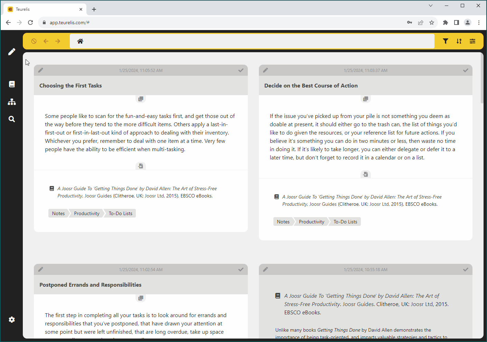
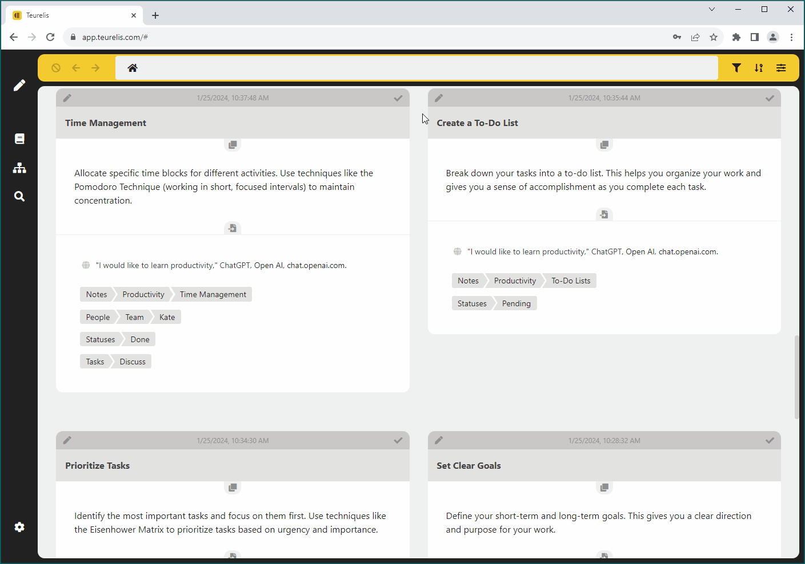
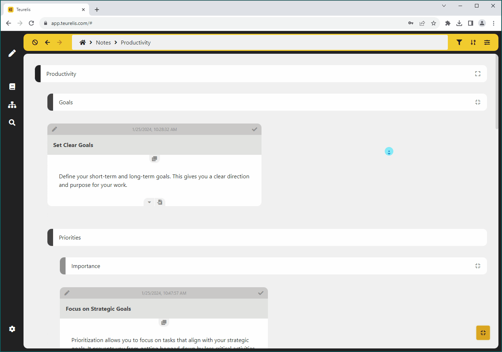
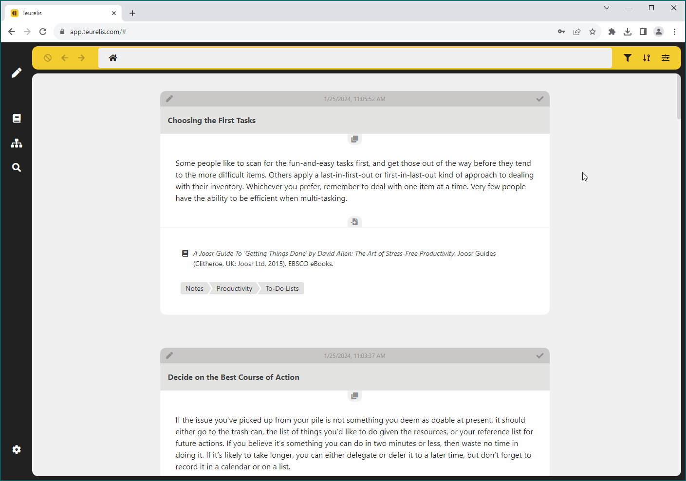
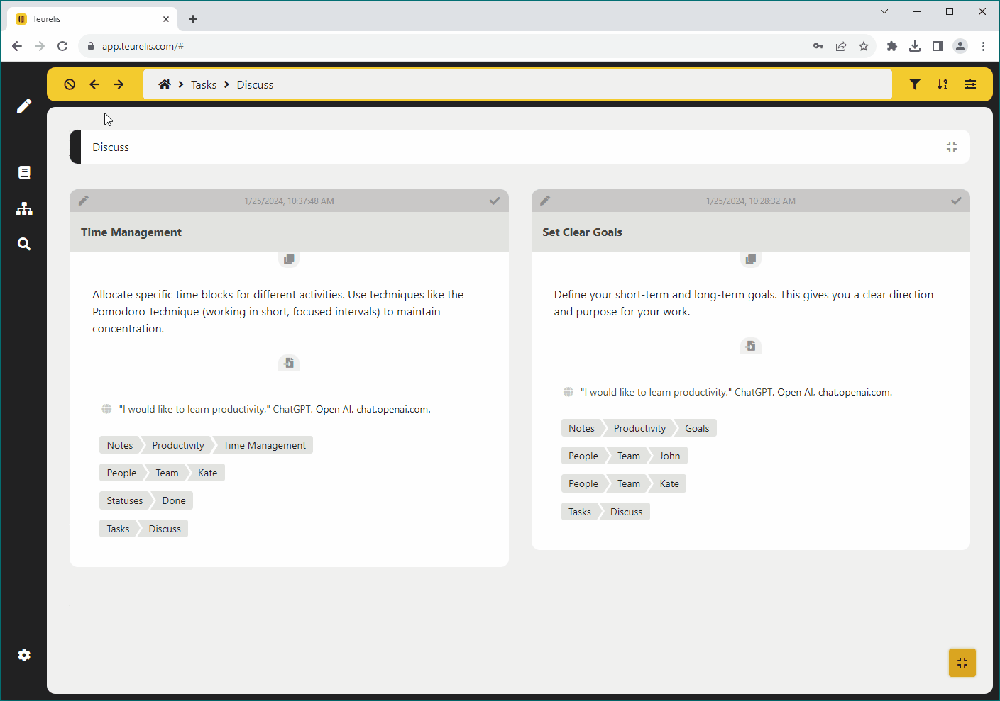
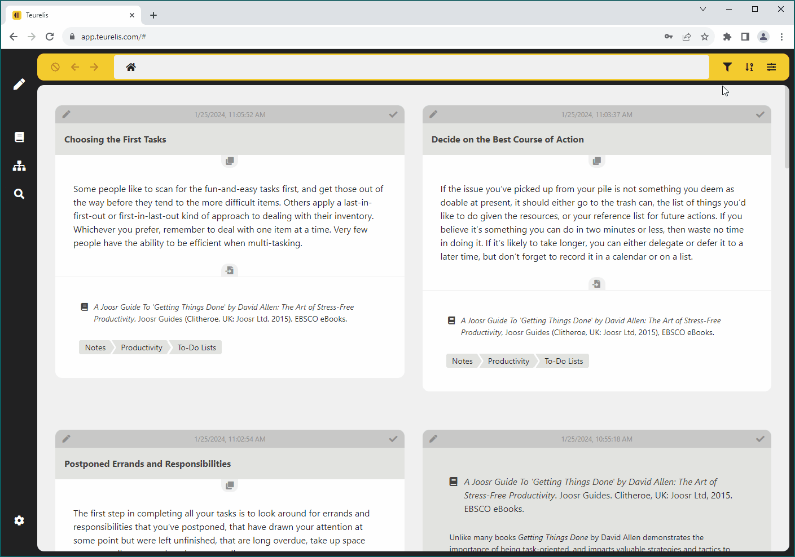

  <a href="#what-is-teurelis">What is Teurelis?</a> | <a href="#features">Features</a> | <a href="#tech-stack">Tech Stack</a>

 

## What is Teurelis?

Teurelis is an academic research management web application, designed for learners, researchers, and thinkers. It also supports managing complex projects.

Access the app landing page at [teurelis.com](https://teurelis.com/).

 

 

### Development Status

Teurelis has been under development since 2021. The current version is fully functional, with all major features implemented and ongoing feature enhancements.

## Features

### Bibliographic and Content Notes

> Click the image to enlarge.

The body of a _bibliographic note_ contains an entry formatted according to the [Chicago Manual of Style 17 (Notes and Bibliography)](https://www.chicagomanualofstyle.org/book/ed17/part3/ch14/toc.html).

Available bibliographic note types include:

- Book
- Book Volume
- Book Part
- Book Volume Part
- Journal
- Article
- Online Resource
- Online Resource Part
- Miscellaneous Resource
- Miscellaneous Resource Part

The body of a _content note_ includes a title and text, supporting syntax from [Remarkable Markdown](https://github.com/jonschlinkert/remarkable).

Both _bibliographic notes_ and _content notes_ support metadata such as:

- Related bibliographic resources
- Subject paths
- Multi-directional link groups to other notes

### Bulk Editing

> Click the image to enlarge.

Bulk editing options include:

- Adding or removing subject paths from selected notes
- Connecting selected notes via a multi-directional link group

### Layout Options

Choose between visually grouping notes in a subject tree or displaying them in a single grid:

 

> Click the image to enlarge.

 

Switch between single-column and multi-column layouts for the note desk:

 

> Click the image to enlarge.

### Option Panels

> Click the image to enlarge.

Option panels provide quick access to:

- Bibliographic reference exploration and subject path trees
- Detailed search functionalities
- Account management (database export/import, password update, logout)

### Browsing Options and Settings

Navigate forward and backward through browsing history:

 

> Click the image to enlarge.

 

Filter notes with detailed criteria, select multiple sorting options, and customize desk and note display settings:

 

> Click the image to enlarge.

### Responsive Design

All features are fully accessible on both mobile and desktop devices.

 

> Click the image to enlarge.

### Browser Support

Teurelis supports the latest versions of major browsers:

## Tech Stack

- [Svelte](https://svelte.dev/)
- [Userbase](https://userbase.com/) (for user authentication and database management)
- [Netlify](https://netlify.com/) (hosting and serverless functions)
- [Webpack](https://webpack.js.org/) (module bundler)

### Dependencies

- [lz-string](https://github.com/pieroxy/lz-string) (string compression)
- [object-sizeof](https://github.com/miktam/sizeof) (memory size estimation for JavaScript objects)
- [remarkable](https://github.com/jonschlinkert/remarkable) (Markdown parsing)
- [dompurify](https://github.com/cure53/DOMPurify) (HTML sanitization)
- [@fortawesome/fontawesome-free](https://github.com/FortAwesome/Font-Awesome) (icon library)
- [webpack-cli](https://github.com/webpack/webpack-cli) (command-line tool for webpack)
- [webpack-dev-server](https://github.com/webpack/webpack-dev-server) (live reload for builds)
- [webpack-merge](https://github.com/survivejs/webpack-merge) (merge configurations for development and production)
- [html-webpack-plugin](https://github.com/jantimon/html-webpack-plugin) (automated HTML generation)
- [css-loader](https://github.com/webpack-contrib/css-loader) (CSS import support for JavaScript)
- [svelte-loader](https://github.com/sveltejs/svelte-loader) (Svelte support in JavaScript)
- [mini-css-extract-plugin](https://github.com/webpack-contrib/mini-css-extract-plugin) (extracts CSS to separate files)
- [svelte-preprocess](https://github.com/sveltejs/svelte-preprocess) (pre-process Svelte components)
- [autoprefixer](https://github.com/postcss/autoprefixer) (automatic vendor prefixing for CSS)
- [css-minimizer-webpack-plugin](https://github.com/webpack-contrib/css-minimizer-webpack-plugin) (CSS minification)
- [terser-webpack-plugin](https://github.com/webpack-contrib/terser-webpack-plugin) (JavaScript minification)
- [svelte-i18n](https://github.com/kaisermann/svelte-i18n) (multi-language support for Svelte)
- [dotenv-webpack](https://github.com/mrsteele/dotenv-webpack) (environment variable management)

## Author

&copy; 2021-2024 [Mateusz Kupiec](https://github.com/m-kupiec). All Rights Reserved.
